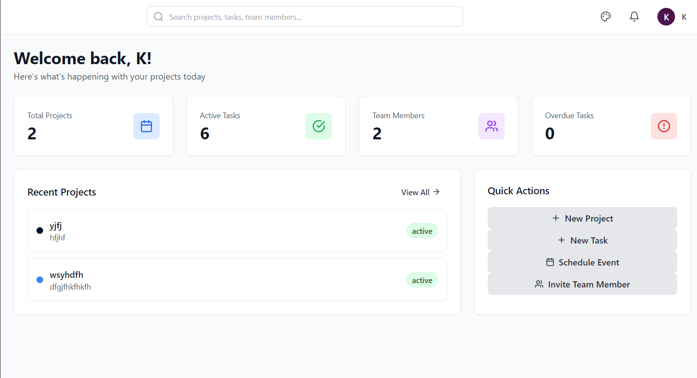
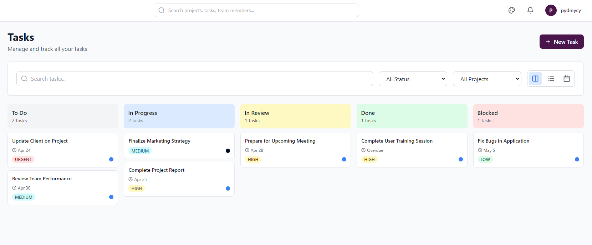
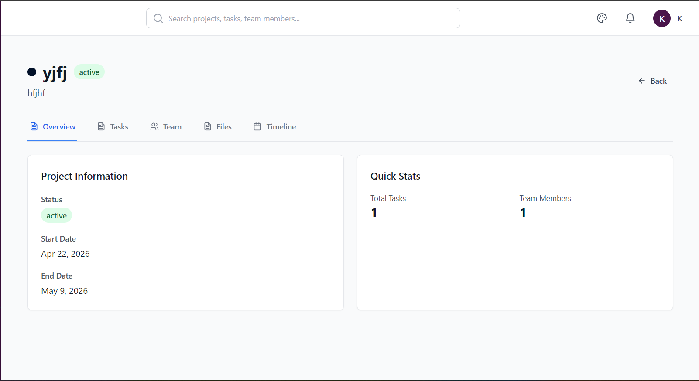
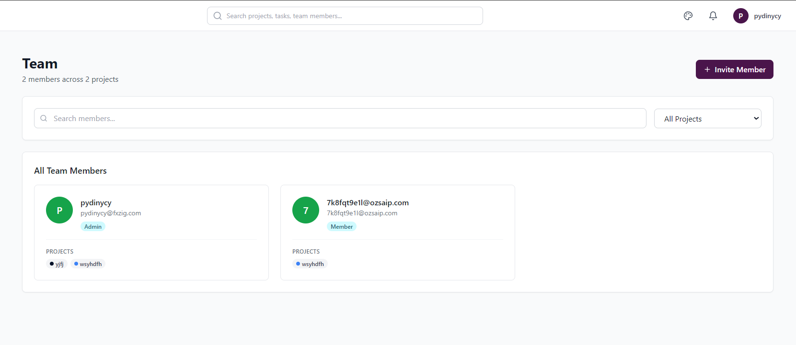
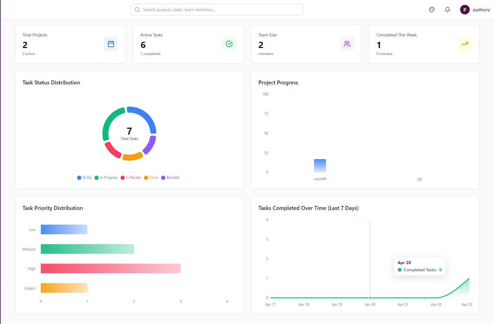

# Project Management App

A comprehensive project management application built with MERN stack.

## Features

- User authentication and authorization
- Project management (CRUD operations)
- Task management with Kanban, List, and Calendar views
- Team collaboration and member invitations
- Calendar and event management
- Reports and analytics
- Dark mode support with multiple themes
- Responsive design

## Project Screenshots

<div align="center">
  <h3>Dashboard</h3>
  
  
  <h3>Task Management</h3>
  
  
  <h3>Project Information</h3>
  
  
  <h3>Team Collaboration</h3>
  
  
  <h3>Reports & Analytics</h3>
  
</div>

## Deployment

- **Frontend**: [Link](https://track-it-kappa-fawn.vercel.app/)
- **Backend**: [Link](https://trackit-xqw6.onrender.com)


## Tech Stack

### Frontend
- React 18
- TypeScript
- Redux Toolkit
- React Router
- Tailwind CSS
- Vite
- Lucide React (Icons)

### Backend
- Node.js
- Express
- TypeScript
- MongoDB with Mongoose
- JWT Authentication
- Nodemailer (Email)

## Environment Variables

Create a `.env` file in the root directory based on `.env.example`:

```env
# Server Configuration
PORT=5500
NODE_ENV=development
MONGODB_URI=mongodb://localhost:27017/project-management
JWT_SECRET=your-super-secret-jwt-key
JWT_EXPIRE=7d
JWT_REFRESH_SECRET=your-refresh-token-key
JWT_REFRESH_EXPIRE=30d
FRONTEND_URL=http://localhost:3000

# Email Configuration
EMAIL_SERVICE=gmail
EMAIL_USER=your-email@gmail.com
EMAIL_PASSWORD=your-app-password
EMAIL_FROM_NAME=TrackIt

# Cloudinary Configuration
CLOUDINARY_CLOUD_NAME=your-cloud-name
CLOUDINARY_API_KEY=your-api-key
CLOUDINARY_API_SECRET=your-api-secret

# Client Configuration (Vite)
VITE_API_URL=http://localhost:5500/api
```

## Email Setup

### Gmail Setup (Recommended)

1. Go to your Google Account settings
2. Enable 2-Step Verification
3. Go to Security > 2-Step Verification > App Passwords
4. Generate an App Password for "Mail"
5. Use this App Password as `EMAIL_PASSWORD` in your `.env` file

## Installation

1. Clone the repository
2. Install dependencies:
   ```bash
   # Root
   npm install

   # Run Client and Server
   npm run dev
   ```

## Running the Application

1. Start MongoDB (if running locally)
2. Start the server:
   ```bash
   npm run dev:server
   ```
3. Start the client:
   ```bash
   npm run dev:client
   ```

## Team Invitations

Team invitations are sent via email. When a user is invited:
1. They receive an email with an invitation link
2. Clicking the link takes them to the invitation acceptance page
3. They create their account with name and password
4. They are automatically logged in and added to the team

## License

MIT
